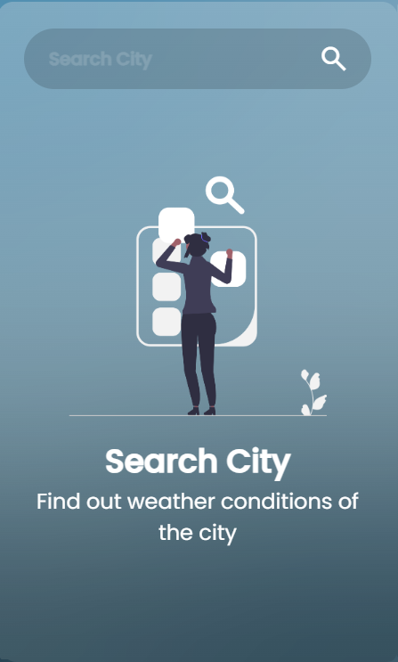
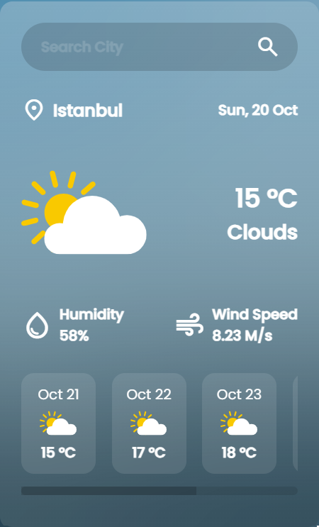
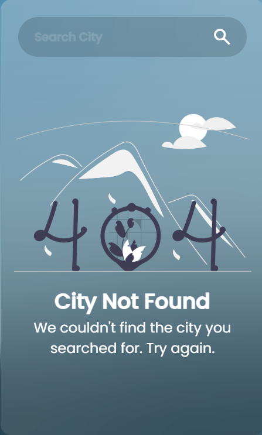

# Weather App 🌤️

A sleek and minimal weather application built with HTML, CSS, and JavaScript. This app allows users to search for real-time weather conditions and a 5-day forecast for any city around the world using the OpenWeatherMap API.

## Features

- 🌍 **Search by City**: Users can input the name of any city to view current weather conditions.
- 📅 **Current Date**: Displays the current date for the searched city.
- ☀️ **Weather Conditions**: Shows temperature, weather conditions (e.g., clouds, rain), humidity, and wind speed.
- ⏩ **5-Day Forecast**: Displays a 5-day weather forecast with daily temperature and weather icons.
- 🔍 **Error Handling**: Handles errors such as "city not found" with an appropriate message.
- 🌀 Loader: A loading spinner is displayed while the app fetches weather data.

## Technologies Used

- **HTML5**: For creating the structure of the web pages.
- **CSS3**: For designing and styling the app.
- **JavaScript (ES6)**: For fetching weather data, handling user input, and updating the UI dynamically.
- **OpenWeatherMap API**: For retrieving real-time weather data and forecasts.

## Demo

<p align="center">
  
</p> <!-- Gif showing how the app works -->


## Screenshots

- **Search Screen**  
  <p align="center">
    
  </p> 
  <p align="center">
  <i>The initial screen where users can search for a city's weather.</i>
  </p>

- **Weather App Main Interface**  
  <p align="center">
    
  </p> 
  <p align="center">
  <i>Displays current weather conditions and a 5-day forecast for the searched city.</i>
  </p>

- **City Not Found**  
  <p align="center">
    
  </p>  
  <p align="center">
  <i>The "City Not Found" message appears when the app cannot find the weather for the searched city.</i>
  </p>

## Getting Started

### Prerequisites

To run this project locally, you will need:

- A modern web browser (e.g., Chrome, Firefox)
- An API key from [OpenWeatherMap](https://openweathermap.org/api) (you can register for a free API key)

### Installation

1. Clone this repository to your local machine:
   ```bash
   git clone https://github.com/megamiii/Weather-App.git
    ```

2. Navigate to the project directory:
    ```bash
    cd Weather-App
    ```

3. Open the `index.html` file in your preferred browser.

### Configuration
You will need to add your OpenWeatherMap API key to the project.

In `script.js`, replace the placeholder apiKey variable with your actual API key:
    ```js
    const apiKey = 'YOUR_API_KEY_HERE';
    ```

## Usage
1. Enter the name of a city in the search bar.
2. Press the search button or hit "Enter" to view the current weather and 5-day forecast for that city.
3. If the city is not found, an error message will be displayed.

## Project Structure
```bash
    Weather-App/
    ## Project Structure
    │
    ├── assets/                         # Static assets (images, icons, etc.)
    │   ├── message/                    # Message images for empty or error states
    │   ├── weather/                    # Weather condition icons
    │   ├── screenshots/                # Screenshots of the app
    │   └── bg.jpg                      # Background image
    │
    ├── style.css                       # Main stylesheet for the app
    │
    ├── script.js                       # Main JavaScript logic for fetching data and updating the UI
    │
    ├── index.html                      # Main HTML structure
    └── README.md                       # Project documentation
```

## API Reference

This project uses the [OpenWeatherMap API](https://openweathermap.org/) for retrieving weather data.

- **Current Weather API**: Retrieves real-time weather data for a given city.
- **5-Day Forecast API**: Provides weather forecasts for the next 5 days in 3-hour intervals.

### Example API Request

```bash
    GET https://api.openweathermap.org/data/2.5/weather?q=Seoul&appid=YOUR_API_KEY&units=metric
```

### Example API Response (Current Weather)

```json
{
  "name": "Seoul",
  "main": {
    "temp": 12.34,
    "humidity": 78
  },
  "weather": [
    {
      "id": 801,
      "main": "Clouds",
      "description": "few clouds",
      "icon": "02d"
    }
  ],
  "wind": {
    "speed": 4.12
  }
}
```

## Acknowledgements

- [OpenWeatherMap](https://openweathermap.org/) for providing the weather data API.
- [Google Material Icons](https://fonts.google.com/icons) for the icons used in the app.
- [Poppins Font](https://fonts.google.com/specimen/Poppins) from Google Fonts.